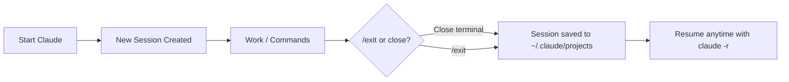
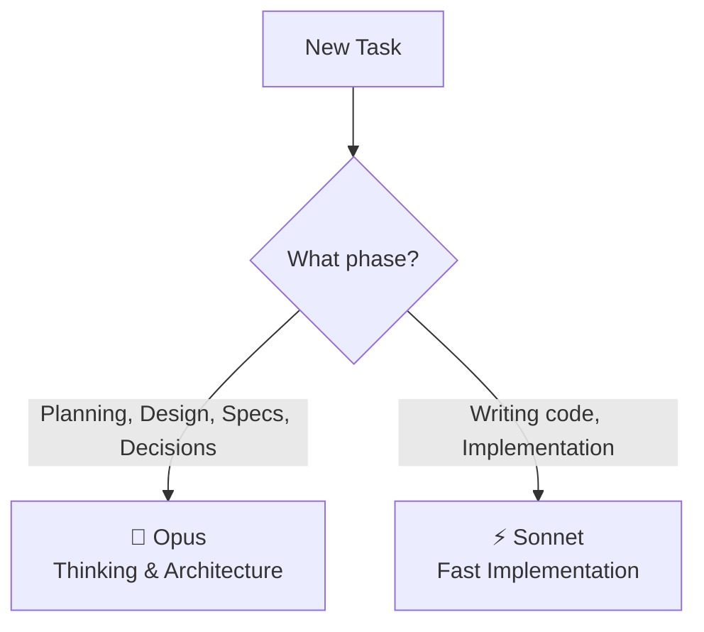
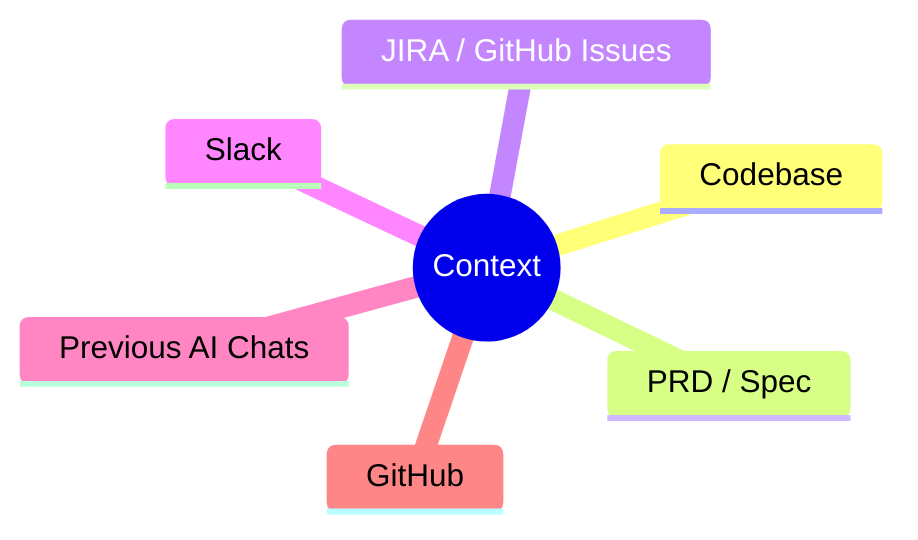
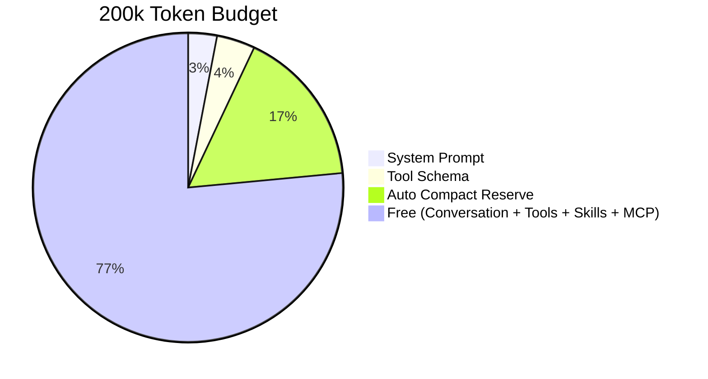
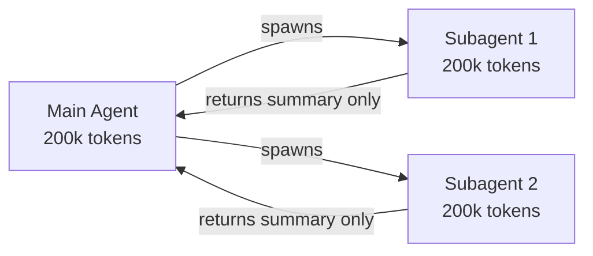
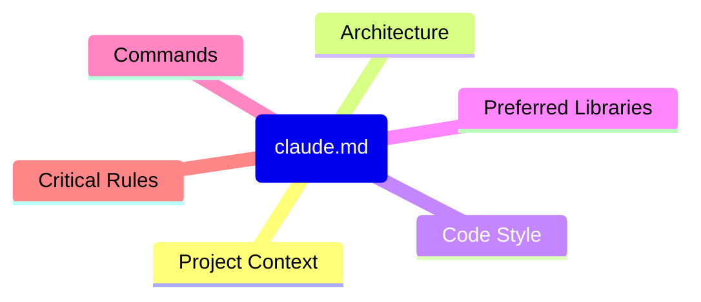
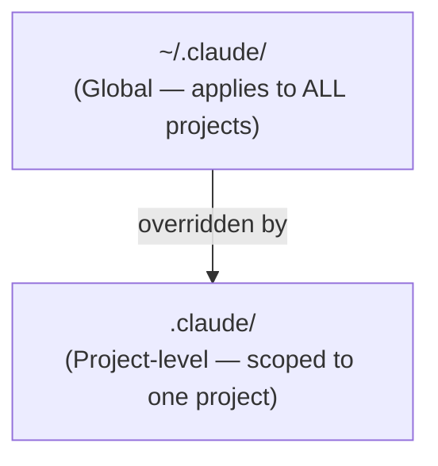
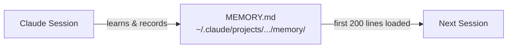

# Claude Code — Course Notes

---

## 1. Vibe Coding

> **Vibe coding** is a style of software development where the programmer relies heavily on AI assistance (LLMs) to generate, modify, and debug code — often with minimal deep understanding of the underlying implementation.

Instead of writing code from first principles, the developer:

- Describes what they want in **natural language**
- Accepts AI-generated output
- Iterates by **feel or intuition** rather than rigorous technical reasoning

---

## 2. Sessions

> A **session** is one complete conversation with Claude Code — everything from when you start until you type `/exit`.

### Key Properties

| Property         | Detail                                |
| ---------------- | ------------------------------------- |
| Unique ID        | Each session has its own identifier   |
| Message History  | Full conversation is captured         |
| Storage Location | `~/.claude/projects`                  |
| Resumable        | Yes — even after closing the terminal |

```bash
claude -r    # Show all sessions (resume any past session)
```

### Session Lifecycle



### Best Practices

- **One session = one task** — keep sessions focused
- **Name your session immediately** after starting
- **Commit frequently** within a session
- Use `/btw` for quick side questions without derailing context
- **Export a session** before a big refactor

### Useful Session Commands

```bash
/export <file_name>.md   # Export session to markdown
/rename                  # Rename the current session
/logout                  # Log out of Claude
/login                   # Log in to Claude
```

---

## 3. Slash Commands Reference

| Command        | Purpose                      |
| -------------- | ---------------------------- |
| `/usage`       | Check your token/API usage   |
| `/model`       | Select the active model      |
| `/stats`       | View session statistics      |
| `/insights`    | View usage insights          |
| `/config`      | Change settings              |
| `/permissions` | Manage permissions           |
| `/theme`       | Change UI theme              |
| `/voice`       | Voice settings               |
| `/context`     | Show current token usage     |
| `/compact`     | Compact conversation history |
| `/clear`       | Clear current context        |
| `/memory`      | View/manage auto memory      |
| `/btw`         | Ask a quick question         |
| `/init`        | Generate a `claude.md` file  |

---

## 4. Models — When to Use What



| Model      | Best For                                          |
| ---------- | ------------------------------------------------- |
| **Opus**   | Planning, design, writing specs, making decisions |
| **Sonnet** | Implementation phase — writing actual code        |

---

## 5. Context

### What is Context?

> **Context** is all the information available to Claude to understand and respond correctly.

### Sources of Context



---

### The 200k Token Window

> Each session gets its own **200,000 token** context window.  
> Tokens are consumed by **both your messages and Claude's replies**.  
> Claude's replies are typically **~6x larger** in tokens than your input.  
> **Every request sends the entire conversation history.**

#### How the 200k Window is Divided



| Allocation                                      | Size                 |
| ----------------------------------------------- | -------------------- |
| System Prompt                                   | ~6k tokens           |
| Tool Schema                                     | ~8k tokens           |
| `claude.md`                                     | Tiny but persistent  |
| Auto Compact Reserve                            | ~33k tokens          |
| Conversation history, tool results, skills, MCP | Remaining free space |

#### Subagents & Context



- Subagents get their **own** 200k token window
- They only **return a summary** back to the main agent (not their full context)

### Context Best Practices

- One session per feature
- Use `/compact` **proactively** (not reactively — before you run out)
- Write **specific and focused** prompts
- Use subagents for **isolated or exploratory** work
- Use `.claudeignore` to keep irrelevant files out of context

---

## 6. `claude.md`

### Why `claude.md` Exists

Sample: https://gemini.google.com/share/9accb7f45d70

| Problem                                         | Solution                              |
| ----------------------------------------------- | ------------------------------------- |
| LLMs have no memory across sessions             | `claude.md` acts as persistent memory |
| Claude can't remember prev session instructions | Instructions live in the file         |
| Repeating instructions is error-prone           | Write once, reuse forever             |
| Inconsistent code generation                    | Consistent rules every session        |

> `claude.md` is a **persistent system prompt** for your project. It guides Claude on how to behave while working on your codebase.

### How to Create It

```bash
/init    # Auto-generate claude.md — do NOT create manually
```

### Contents of `claude.md`



> **Keep `claude.md` under 200 lines** — quality degrades beyond that.

---

## 7. The `.claude` Folder

> The `.claude` folder is a **local configuration folder** that controls how Claude behaves — either for a specific project or across all projects on your machine.

### Scope



| Level       | Location                      | Scope                        |
| ----------- | ----------------------------- | ---------------------------- |
| **Global**  | `~/.claude/`                  | All projects on your machine |
| **Project** | `./.claude/` inside a project | That project only            |

### Folder Structure

```
.claude/
├── settings.json          # Shared config — commit to git, share with team
├── settings.local.json    # Personal config — DO NOT commit to git
├── commands/              # Custom slash commands
├── rules/                 # Rule files (code style, testing, security, etc.)
├── skills/                # How specific tasks should be achieved
└── agents/                # Subagent definitions
```

### Rules Best Practice

Instead of bloating `claude.md`, create **separate rule files** for each concern and reference them:

```
.claude/rules/
├── code-style.md
├── testing.md
├── security.md
└── api-conventions.md
```

Then reference them in your `claude.md`.

> Use `claude.local.md` for personal configurations — **do not check this into git**.

### Global `claude.md`

- Lives at `~/.claude/claude.md`
- Applies across all projects
- You can also add `claude.md` files **inside subdirectories** of a large codebase for folder-level guidance

---

## 8. Auto Memory

> **Auto memory** is a persistent directory where Claude records learnings, insights, and patterns as it works on your project.

### Location

```
~/.claude/projects/<project-name>/memory/MEMORY.md
```

### Key Rules

- Only the **first 200 lines** of `MEMORY.md` are loaded into context
- Managed via the `/memory` slash command



---

## Quick Reference Cheat Sheet

```
Sessions      claude -r | /export | /rename | /btw
Context       /context | /compact | /clear
Models        /model → Opus (plan) | Sonnet (build)
Config        /config | /permissions | /theme
Info          /usage | /stats | /insights
Auth          /login | /logout
Memory        /memory
Init          /init → generates claude.md
```
